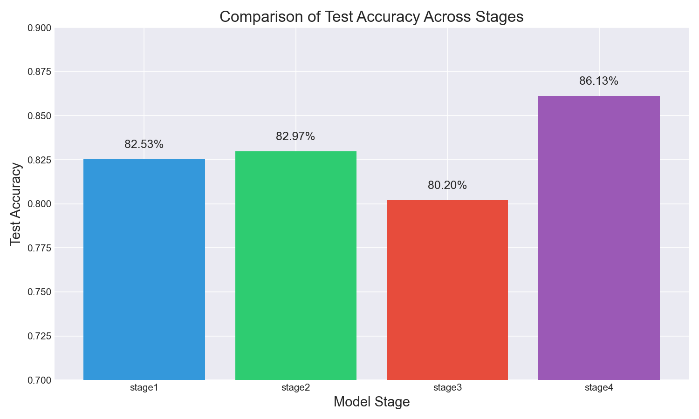
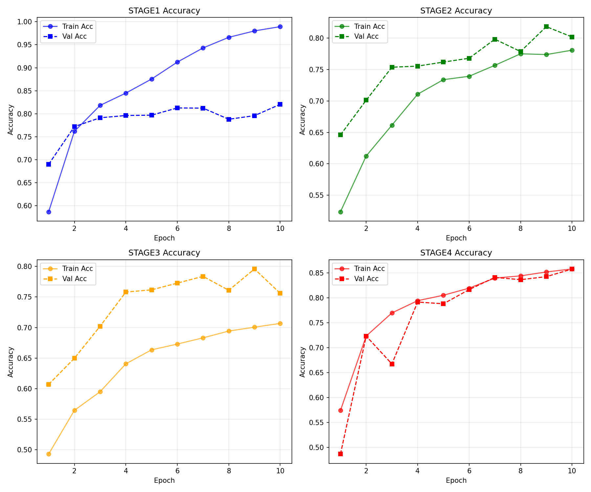
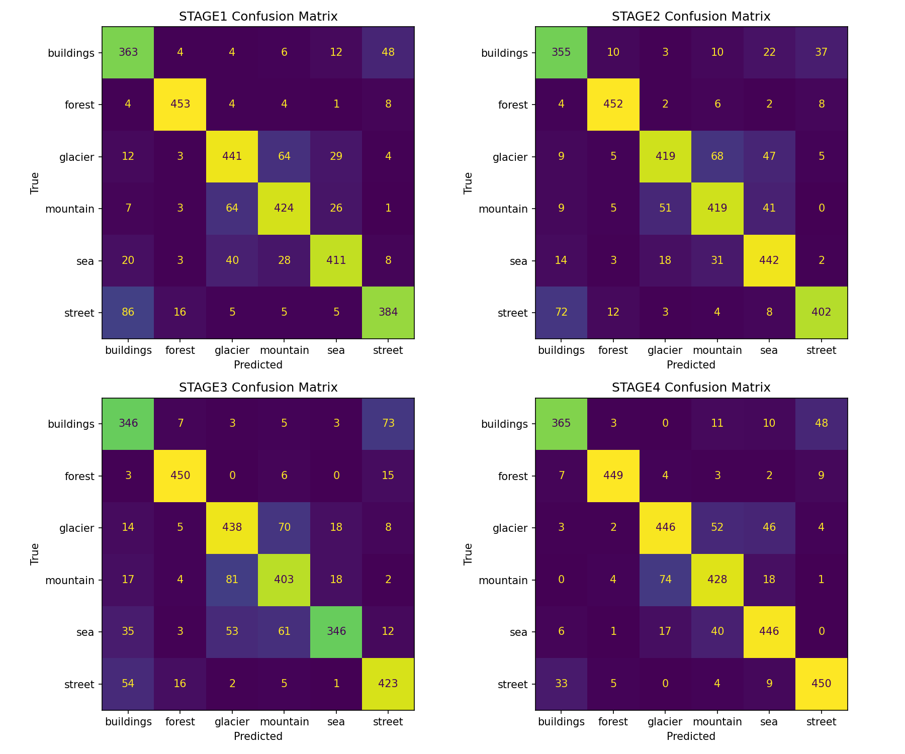
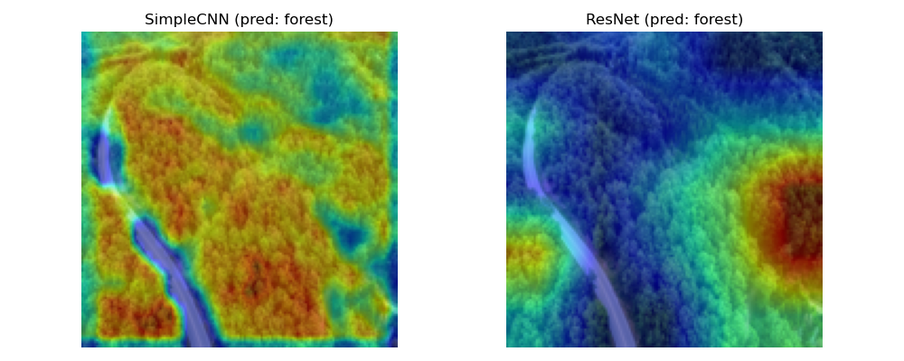

# 自然场景图像分类的模块化改进研究

[](https://www.python.org/)
[](https://pytorch.org/)
[](https://opensource.org/licenses/MIT)

## 项目简介
本项目以智能相册分类为背景，通过**从简单到复杂**的模块化演进，系统研究 Batch Normalization、Dropout、数据增强和残差连接对图像分类性能的影响。在 Intel Scene 数据集（6 类场景，约 2.5 万张图片）上，最终模型（简化 ResNet）达到 **86.13%** 的测试准确率，相比基线（SimpleCNN）提升 3.6%。项目包含完整的训练脚本、对比实验、消融分析、可视化工具以及 Gradio 交互式 Demo。
### 项目结构
```bash
.
├── data/                 # 数据集
│   ├── seg_pred
│   ├── seg_test
│   └── seg_train
├── models/               # 模型定义
│   ├── simple_cnn.py
│   ├── cnn_bn_dropout.py
│   ├── resblock.py
│   └── simple_resnet.py
├── utils/                # 工具函数
│   ├── data_loader.py
│   ├── train_eval.py
│   └── visualize.py
├── experiments/          # 实验结果
├── checkpoints/          # 模型权重
├── stage1_train.py       # 训练脚本
├── stage2_train.py
├── stage3_train.py
├── stage4_train.py
├── ablation_study.py     # 消融实验
├── collect_results.py    # 结果汇总
├── plot_results.py       # 绘图
├── gradio_demo.py        # Gradio演示
├── gradio_demo_CAM.py    # Gradio演示(含热力图)
├── requirements.txt      # 依赖列表
├── .gitignore            # Git忽略规则
└── README.md
```
### 说明
```bash
训练脚本
python stage1_train.py   # 阶段一
python stage2_train.py   # 阶段二
python stage3_train.py   # 阶段三
python stage4_train.py   # 阶段四
训练日志和最佳模型会自动保存至 experiments/ 和 checkpoints/
```
### Demo运行
```bash
gradio_demo.py     # 四个阶段的识别对比
gradio_demo_CAM.py # 包含热力图的阶段1、2对比
```

## 快速开始
```bash
# 克隆仓库
git clone https://github.com/QingyanXia/sceneClassify.git
cd sceneClassify

# 创建虚拟环境（推荐 conda）
conda create -n scene_classify python=3.9
conda activate scene_classify

# 安装依赖
pip install -r requirements.txt
```
## 数据集
- **名称**：Intel Image Classification
- **类别**：建筑（buildings）、森林（forest）、冰川（glacier）、山（mountain）、海（sea）、街道（street）
- **来源**：[Kaggle](https://www.kaggle.com/puneet6060/intel-image-classification)
- **下载**：请从上述链接下载，解压后将 `seg_train` 和 `seg_test` 文件夹置于 `data/` 目录下，也可直接从本仓库下载。

## 方法演进
| 阶段 | 模型 | 关键改进 | 测试准确率 |
|------|------|----------|------------|
| 一 | SimpleCNN（3层卷积+2层全连接） | 基线 | 82.53% |
| 二 | +BN+Dropout | 每层卷积后加BN，全连接前加Dropout | 82.97% |
| 三 | +数据增强 | 随机翻转、旋转、颜色抖动 | 80.20% |
| 四 | 简化 ResNet | 残差连接 | **86.13%** |

## 实验结果
### 对比柱状图


### 训练曲线
四个阶段训练/验证准确率随 epoch 的变化：


### 混淆矩阵
阶段四在测试集上的混淆矩阵：


### 消融实验
以阶段四为基准，分别去除残差连接、BN、数据增强后的准确率下降：

| 消融设置 | 准确率 | 下降幅度 |
|----------|--------|----------|
| 完整阶段四 | 86.13% | - |
| 去掉残差 | 83.50% | 2.63% |
| 去掉 BN   | 84.20% | 1.93% |
| 去掉数据增强 | 82.30% | 3.83% |

### Grad-CAM 可视化
比较阶段一（SimpleCNN）和阶段四（ResNet）的关注区域：


## 未来工作
- 引入注意力机制（如 SE 模块）进一步提升性能
- 尝试 MixUp / CutMix 数据增强
- 使用预训练模型进行迁移学习对比
- 集成多个模型提升鲁棒性

## 许可证
本项目采用 MIT 许可证，详情请见 [LICENSE](https://license/) 文件。

## 致谢
- 感谢 Intel 提供数据集
- 感谢 PyTorch 开源社区