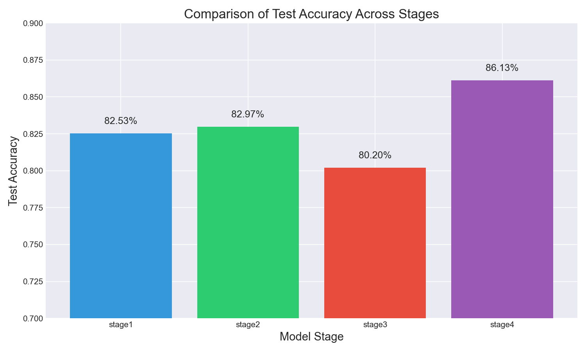
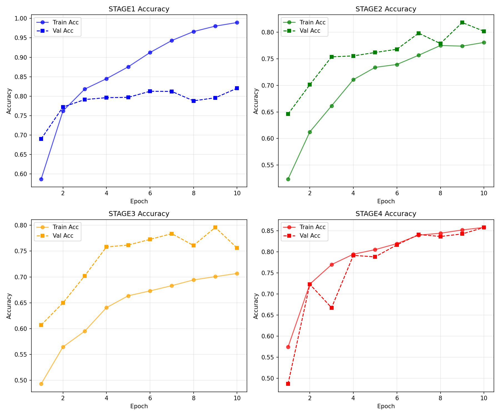
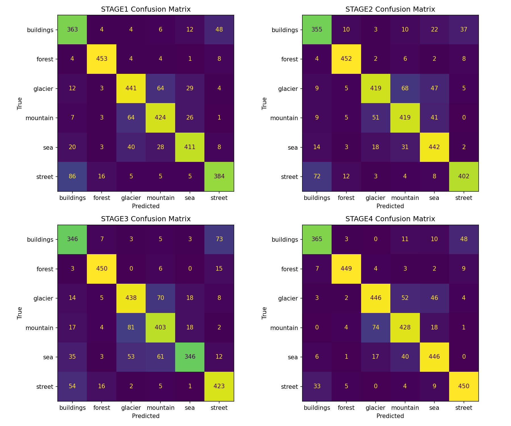
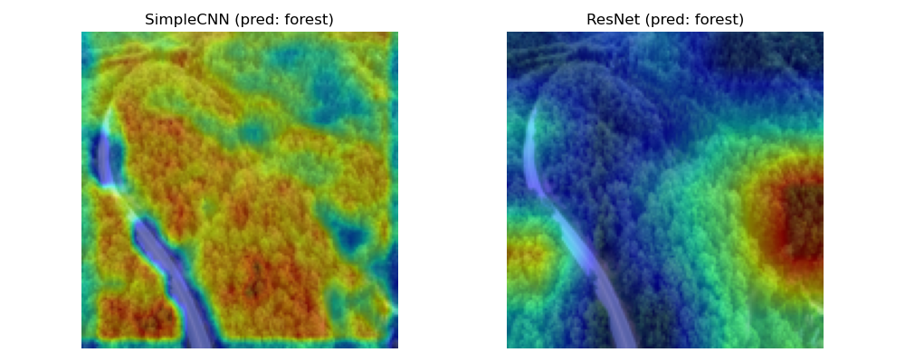

# 自然场景图像分类的模块化改进研究

[](https://www.python.org/)
[](https://pytorch.org/)
[](https://opensource.org/licenses/MIT)

## 项目简介
本项目以智能相册分类为背景，在Intel Scene数据集（6类场景，2.5万张图像）上系统探索了从简单CNN到先进优化策略的模块化改进路径。通过逐步引入**Batch Normalization、Dropout、数据增强、残差连接、SE注意力、标签平滑、余弦退火、RandAugment及模型集成**，最终集成模型达到 **92.10%** 的测试准确率，较基线（SimpleCNN）提升近10个百分点。项目包含完整的训练脚本、对比实验、可视化工具及Gradio交互式Demo

### 整体思路推进
#### 阶段一：基线 CNN —— 发现过拟合
- **观察**：训练准确率快速逼近 100%，验证准确率却停滞在 83% 左右，且两者差距持续扩大。
- **诊断**：模型容量充足，但缺乏正则化，导致严重过拟合。
- **改进动机**：引入 Dropout 和 BatchNorm，抑制过拟合，同时加速收敛。

#### 阶段二：+BN+Dropout —— 验证正则化效果
- **观察**：验证准确率反超训练，曲线平稳，但最终准确率仅提升至 82.97%，提升有限。
- **诊断**：正则化有效，但模型容量可能不足，或训练数据不够多样。
- **改进动机**：增加数据增强，提升泛化能力。

#### 阶段三：+数据增强 —— 泛化能力检验
- **观察**：训练准确率下降（因增强增加了难度），验证准确率同步上升，但最终 80.97% 反而低于阶段二。
- **诊断**：数据增强可能过强，或训练轮次不足（曲线仍在上升）。同时，混淆矩阵显示冰川与山、海，建筑与街道存在明显混淆。
- **改进动机**：加深网络（残差连接），提升特征提取能力，同时保留数据增强。
    

#### 阶段四：简化 ResNet —— 容量提升
- **观察**：验证准确率提升至 86.13%，训练曲线平稳，但过拟合仍存在（训练与验证差距约 4%）。混淆矩阵显示冰川/山/海混淆未完全解决。
- **诊断**：残差连接有效，但需更强的正则化和针对性策略。
- **改进动机**：引入注意力机制，让模型关注区分性特征。
    

#### 阶段六：+SE 注意力 —— 通道特征重标定
- **观察**：测试准确率 86.33%，提升微小。训练曲线出现波动（第5 epoch 骤降），说明训练不稳定。
- **诊断**：注意力机制有效但被训练不稳定性掩盖；模型可能对超参数敏感。
- **改进动机**：优化训练策略（权重衰减、标签平滑、余弦退火），稳定训练并提升泛化。
    

#### 阶段七：优化策略组合 —— 大幅跃升
- **观察**：测试准确率飙升至 **90.60%**，训练曲线平滑，验证损失持续下降。混淆矩阵显示冰川/山/海混淆明显改善，但建筑与街道区分仍有限。
- **诊断**：优化策略成功释放模型潜力，但少数类（建筑）可能因样本不平衡或类内差异大而落后。
- **改进动机**：类别加权损失，让模型更关注建筑类。
    

#### 阶段八：类别加权 —— 平衡各类别
- **观察**：建筑类召回率提升，但整体准确率略降至 90.33%，其他类微降。训练后期验证准确率波动。
- **诊断**：加权可能过度补偿，导致其他类受损；需要更精细的平衡。
- **改进动机**：尝试更先进的正则化与数据增强组合（RandAugment + MixUp + 更高 weight decay）。
    

#### 阶段十：强正则化 + 先进增强 —— 达到单模型巅峰
- **观察**：验证准确率稳步升至 92.38%，测试准确率 **91.60%**。训练准确率维持 50-60%（MixUp 正常现象），验证损失持续下降，无过拟合迹象。
- **诊断**：当前配置已达单模型容量上限，进一步延长训练可能带来微小收益，但边际效应递减。
- **改进动机**：探索集成学习，利用多个优化模型的互补性。
    

#### 阶段十一：超长训练 —— 验证收敛性
- **观察**：训练至 55 epoch 早停，最佳验证 91.77%，测试 90.93%，略低于阶段十。
- **诊断**：更长训练未超越阶段十，说明阶段十已接近最优；但阶段十一与其他模型可能存在互补性。
- **改进动机**：集成阶段七、八、十、十一，融合不同优化方向的优势。
    

#### 阶段十二：集成学习 —— 最终突破
- **观察**：集成模型测试准确率 **92.10%**，各类别召回率均衡提升（冰川 86.6%、山 88.0%、建筑 91.3%）。
- **结论**：通过多轮“观察-假设-验证”循环，系统探索了正则化、数据增强、注意力机制、训练策略和集成学习的组合，最终将场景分类准确率从基线 82.53% 提升至 **92.10%**，验证了模块化改进与迭代优化的有效性。
- 
### 阶段一~阶段四工作
本项目以智能相册分类为背景，通过从简单到复杂的模块化演进，系统研究 Batch Normalization、Dropout、数据增强和残差连接对图像分类性能的影响。在 Intel Scene 数据集（6 类场景，约 2.5 万张图片）上，最终模型（简化 ResNet）达到 86.13% 的测试准确率，相比基线（SimpleCNN）提升 3.6%。项目包含完整的训练脚本、对比实验、消融分析、可视化工具以及 Gradio 交互式 Demo。
### 阶段五~阶段十一工作
[跳转到文末查看最新进展](#新工作)
- **正则化与数据增强**：阶段七的权重衰减、标签平滑、余弦退火带来了首次大幅提升（90.60%）。阶段十引入 RandAugment 和更强的正则化（Dropout、更高 weight decay）进一步将性能推至 91.60%。
- **集成学习**：利用多个优化模型的互补性，最终集成模型突破 92%，验证了模型融合的有效性。
- **易混淆类别改善**：通过针对性优化，glacier 与 mountain、buildings 与 street 的混淆得到有效缓解。

### 项目结构
```bash
.
├── data/                 # 数据集
│   ├── seg_pred
│   ├── seg_test
│   └── seg_train
├── models/               # 模型定义
│   ├── __init__.py
│   ├── simple_cnn.py
│   ├── cnn_bn_dropout.py
│   ├── resblock.py
│   └── simple_resnet.py
├── utils/                # 工具函数
│   ├── data_loader.py
│   ├── train_eval.py
│   └── visualize.py
├── experiments/          # 实验结果
├── checkpoints/          # 模型权重
├── stage1_train.py       # 训练脚本
├── stage2_train.py
├── stage3_train.py
├── stage4_train.py
.
.
.
├── ablation_study.py     # 消融实验
├── collect_results.py    # 结果汇总
├── plot_results.py       # 绘图
.
.
.
├── gradio_demo.py        # Gradio演示
├── gradio_demo_CAM.py    # Gradio演示(含热力图)
├── requirements.txt      # 依赖列表
├── .gitignore            # Git忽略规则
└── README.md
```
### 说明
```bash
训练脚本
python stage1_train.py   # 阶段一
python stage2_train.py   # 阶段二
python stage3_train.py   # 阶段三
python stage4_train.py   # 阶段四
...
训练日志和最佳模型会自动保存至 experiments/ 和 checkpoints/
```
### Demo运行
```bash
gradio_demo.py     # 四个阶段的识别对比
gradio_demo_CAM.py # 包含热力图的阶段1、2对比
gradio_demo_final.py # 包含阶段一、四、七及集成模型的 Gradio 演示脚本
```

## 快速开始
```bash
# 克隆仓库
git clone https://github.com/QingyanXia/sceneClassify.git
cd sceneClassify

# 创建虚拟环境（推荐 conda）
conda create -n scene_classify python=3.9
conda activate scene_classify

# 安装依赖
pip install -r requirements.txt
```
## 数据集
- **名称**：Intel Image Classification
- **类别**：建筑（buildings）、森林（forest）、冰川（glacier）、山（mountain）、海（sea）、街道（street）
- **来源**：[Kaggle](https://www.kaggle.com/puneet6060/intel-image-classification)
- **下载**：请从上述链接下载，解压后将 `seg_train` 和 `seg_test` 文件夹置于 `data/` 目录下，也可直接从本仓库下载。

## 方法演进
| 阶段 | 模型 | 关键改进 | 测试准确率 |
|------|------|----------|------------|
| 一 | SimpleCNN（3层卷积+2层全连接） | 基线 | 82.53% |
| 二 | +BN+Dropout | 每层卷积后加BN，全连接前加Dropout | 82.97% |
| 三 | +数据增强 | 随机翻转、旋转、颜色抖动 | 80.20% |
| 四 | 简化 ResNet | 残差连接 | **86.13%** |

## 实验结果
### 对比柱状图


### 训练曲线
四个阶段训练/验证准确率随 epoch 的变化：


### 混淆矩阵
阶段四在测试集上的混淆矩阵：

### Grad-CAM 可视化
比较阶段一（SimpleCNN）和阶段四（ResNet）的关注区域：


## 未来工作（已经完成）
- 引入注意力机制（如 SE 模块）进一步提升性能
- 尝试 MixUp / CutMix 数据增强
- 使用预训练模型进行迁移学习对比
- 集成多个模型提升鲁棒性

## 许可证
本项目采用 MIT 许可证，详情请见 [LICENSE](https://license/) 文件。

## 致谢
- 感谢 Intel 提供数据集
- 感谢 PyTorch 开源社区

# 新工作
在阶段四（简化 ResNet，86.13%）的基础上，继续探索更先进的优化策略，逐步提升模型性能：

|阶段|模型/方法|关键改进|测试准确率|
|---|---|---|---|
|五|+MixUp|图像混合增强|86.85% |
|六|+SE注意力|通道注意力机制|86.33%|
|七|优化策略|权重衰减、标签平滑、余弦退火|**90.60%**|
|八|类别加权|针对少数类加权损失|90.33%|
|九|延长训练|40 epoch + 早停|89.43%|
|十|强正则化+先进增强|RandAugment + MixUp + Dropout(0.3)|**91.60%**|
|十一|超长训练|80 epoch + 早停10|90.93%|
|十二|集成学习|平均阶段七、八、十、十一的 Softmax 输出|**92.10%**|

通过集成阶段七、八、十、十一四个模型，达到了 **92.10%** 的测试准确率，各类别召回率如下：

|类别|召回率|
|---|---|
|buildings|91.30%|
|forest|98.52%|
|glacier|86.62%|
|mountain|88.00%|
|sea|95.49%|
|street|93.61%|
### 消融实验（更新后）
为验证各模块的有效性，我们在阶段十基础上进行了系统消融实验。结果如下：
![[Pasted image 20260321233500.png]]
**关键发现**：
- **RandAugment** 和 **余弦退火** 是影响最大的组件，移除后准确率下降超过 0.8%。
- 标签平滑、MixUp、权重衰减在当前强正则化下贡献微弱，可安全移除，不影响性能。
- 组合消融（移除 MixUp、标签平滑、权重衰减）后准确率仍达 91.63%，证明这些组件存在冗余。

## 后续展望
- 探索更高效的模型结构（如 EfficientNet、ConvNeXt）进一步提升性能。
- 尝试半监督学习或自监督预训练，利用无标签数据增强泛化能力。
- 将模型部署到移动端，实现轻量化实时分类。
- 使用预训练模型