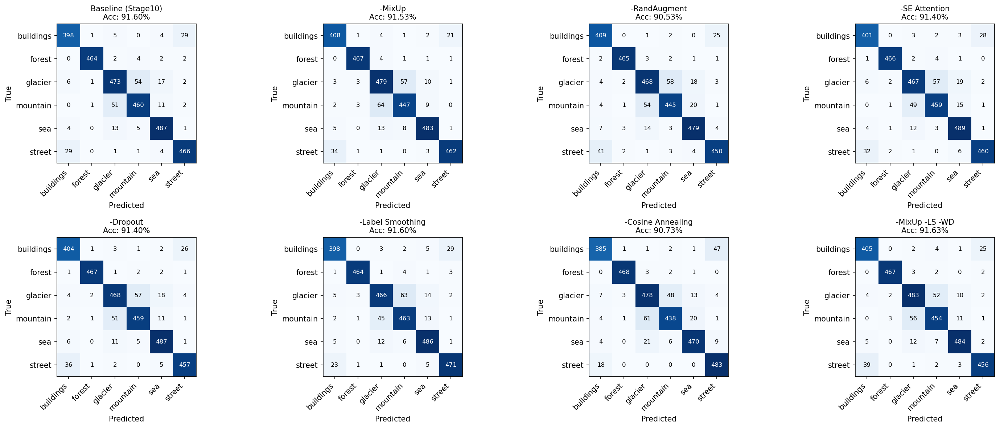

# 自然场景图像分类的模块化改进研究

[](https://www.python.org/)
[](https://pytorch.org/)
[](https://opensource.org/licenses/MIT)

## 项目简介

本研究以智能相册分类为应用背景，在Intel Scene数据集（6类场景，2.5万张图像）上，系统性地探索了从简单卷积神经网络（CNN）到先进优化策略的模块化改进路径。通过逐步引入**批量归一化（Batch Normalization）、随机失活（Dropout）、数据增强、残差连接、挤压-激励（SE）注意力机制、标签平滑、余弦退火、RandAugment及模型集成**等一系列技术，最终集成模型取得了 **92.10%** 的测试准确率，相较基线模型（SimpleCNN）提升了近10个百分点。本项目提供了完整的训练脚本、对比实验记录、可视化分析工具及基于Gradio的交互式演示程序。

### 研究思路与演进

本研究遵循“观察-假设-验证”的迭代优化范式，各阶段的核心动机与发现如下：

#### 阶段一：基线CNN —— 发现过拟合
- **观察**：训练集准确率迅速逼近100%，而验证集准确率停滞在83%左右，两者差距持续扩大。
- **诊断**：模型容量充足但缺乏有效正则化，导致严重的过拟合现象。
- **改进动机**：引入Dropout和BatchNorm，抑制过拟合，并加速模型收敛。

#### 阶段二：+BN+Dropout —— 验证正则化效果
- **观察**：验证集准确率曲线趋于平稳，但最终准确率仅提升至82.97%，提升有限。
- **诊断**：正则化有效抑制了过拟合，但模型容量可能成为瓶颈，或训练数据的多样性不足。
- **改进动机**：增加数据增强策略，提升模型泛化能力。

#### 阶段三：+数据增强 —— 泛化能力检验
- **观察**：训练集准确率因增强带来的难度提升而下降，验证集准确率同步上升，但最终80.97%的准确率低于阶段二。混淆矩阵显示，“冰川”与“山”、“海”以及“建筑”与“街道”之间存在明显混淆。
- **诊断**：数据增强强度可能过高，或训练轮次不足。同时，模型特征提取能力有待加强。
- **改进动机**：通过引入残差连接加深网络，提升特征提取能力，同时保留数据增强。

#### 阶段四：简化ResNet —— 容量提升
- **观察**：验证集准确率提升至86.13%，训练曲线平稳，但过拟合现象依然存在（训练与验证准确率差距约4%）。混淆矩阵显示，冰川/山/海之间的混淆问题未完全解决。
- **诊断**：残差连接有效提升了模型性能，但需要更强的正则化和更针对性的特征学习策略。
- **改进动机**：引入注意力机制，引导模型关注更具区分性的特征。

#### 阶段六：+SE注意力 —— 通道特征重标定
- **观察**：测试准确率为86.33%，提升微小。训练曲线出现波动，表明训练稳定性不足。
- **诊断**：注意力机制的有效性被训练不稳定性所掩盖；模型对超参数可能更为敏感。
- **改进动机**：优化训练策略（如权重衰减、标签平滑、余弦退火），以稳定训练并提升泛化性能。

#### 阶段七：优化策略组合 —— 大幅跃升
- **观察**：测试准确率大幅提升至 **90.60%**，训练曲线平滑，验证损失持续下降。混淆矩阵显示冰川/山/海混淆明显改善，但建筑与街道的区分仍有提升空间。
- **诊断**：优化策略组合成功释放了模型潜力，但少数类别（建筑）可能因样本不平衡或类内差异大而表现落后。
- **改进动机**：采用类别加权损失函数，使模型更加关注建筑等类别。

#### 阶段八：类别加权 —— 平衡各类别
- **观察**：建筑类召回率有所提升，但整体准确率略微下降至90.33%，其他类别性能亦有微小下降。
- **诊断**：简单的加权策略可能导致过度补偿，对其他类别造成负面影响，需要更精细的平衡手段。
- **改进动机**：尝试更先进的正则化与数据增强组合（如RandAugment、MixUp及更高的权重衰减）。

#### 阶段十：强正则化 + 先进增强 —— 达到单模型巅峰
- **观察**：验证集准确率稳步升至92.38%，测试准确率 **91.60%**。训练集准确率维持在50-60%（MixUp的正常现象），验证损失持续下降，无过拟合迹象。
- **诊断**：当前配置已接近单模型在此数据集上的性能上限，进一步延长训练可能带来微小收益，但边际效应递减。
- **改进动机**：探索集成学习，利用多个优化模型的互补性，以期实现性能突破。

#### 阶段十一：超长训练 —— 验证收敛性
- **观察**：训练至55个epoch时早停，最佳验证准确率为91.77%，测试准确率为90.93%，略低于阶段十。
- **诊断**：更长的训练周期未超越阶段十的性能，表明阶段十已接近最优收敛点。但该模型的特性可能与阶段十及其他模型存在互补性。
- **改进动机**：集成阶段七、八、十、十一的模型，融合不同优化路径的优势。

#### 阶段十二：集成学习 —— 最终突破
- **观察**：集成模型测试准确率最终达到 **92.10%**，各类别召回率均有均衡提升（冰川86.6%、山88.0%、建筑91.3%）。
- **结论**：通过系统性的“观察-假设-验证”循环，本研究逐步探索并整合了正则化、数据增强、注意力机制、先进训练策略和集成学习等多种方法，成功将场景分类准确率从基线模型的82.53%提升至 **92.10%**，充分验证了模块化改进与迭代优化路径的有效性。

---

## 实验方法与结果

### 阶段一至阶段四：基础模块探索

本部分工作旨在建立性能基线并验证基础正则化与网络结构改进的有效性。在Intel Scene数据集上，最终模型（简化ResNet）达到86.13%的测试准确率，相比基线（SimpleCNN）提升3.6%。

### 阶段五至阶段十二：先进策略与集成

在阶段四的基础上，本研究继续探索更先进的优化策略，逐步提升模型性能。各阶段详细配置与结果如下表所示：

| 阶段 | 模型/方法 | 关键改进 | 测试准确率 |
|------|-----------|----------|------------|
| 五 | +MixUp | 图像混合增强 | 86.85% |
| 六 | +SE注意力 | 通道注意力机制 | 86.33% |
| 七 | 优化策略 | 权重衰减、标签平滑、余弦退火 | **90.60%** |
| 八 | 类别加权 | 针对少数类加权损失 | 90.33% |
| 九 | 延长训练 | 40 epoch + 早停 | 89.43% |
| 十 | 强正则化+先进增强 | RandAugment + MixUp + Dropout(0.3) | **91.60%** |
| 十一 | 超长训练 | 80 epoch + 早停 | 90.93% |
| 十二 | 集成学习 | 平均阶段七、八、十、十一的Softmax输出 | **92.10%** |

通过集成阶段七、八、十、十一四个模型，最终取得了 **92.10%** 的测试准确率，各类别召回率如下：

| 类别 | 召回率 (%) |
|------|-----------|
| buildings | 91.30 |
| forest | 98.52 |
| glacier | 86.62 |
| mountain | 88.00 |
| sea | 95.49 |
| street | 93.61 |

#### 消融实验
为验证各模块的有效性，本研究在阶段十（单模型最佳配置）的基础上进行了系统性的消融实验。实验结果如下图所示，揭示了各组件对最终性能的贡献程度。



**关键发现**：
- **RandAugment** 和 **余弦退火** 是影响性能最大的两个组件，移除后准确率下降超过0.8%。
- 在当前强正则化配置下，标签平滑、MixUp、权重衰减的贡献相对微弱，可安全移除而几乎不影响性能。
- 组合消融实验（同时移除MixUp、标签平滑、权重衰减）后，模型准确率仍可达91.63%，进一步证明了这些组件在当前配置下的冗余性。

---

## 项目结构

```bash
.
├── data/                 # 数据集
│   ├── seg_pred
│   ├── seg_test
│   └── seg_train
├── models/               # 模型定义
│   ├── __init__.py
│   ├── simple_cnn.py
│   ├── cnn_bn_dropout.py
│   ├── resblock.py
│   └── simple_resnet.py
├── utils/                # 工具函数
│   ├── data_loader.py
│   ├── train_eval.py
│   └── visualize.py
├── experiments/          # 实验结果
├── checkpoints/          # 模型权重
├── stage1_train.py       # 阶段一训练脚本
├── stage2_train.py
├── stage3_train.py
├── stage4_train.py
.
.
.
├── ablation_study.py     # 消融实验脚本
├── collect_results.py    # 结果汇总脚本
├── plot_results.py       # 绘图脚本
.
.
.
├── gradio_demo.py        # Gradio演示（阶段对比）
├── gradio_demo_CAM.py    # Gradio演示（含热力图）
├── requirements.txt      # 依赖列表
├── .gitignore            # Git忽略规则
└── README.md
```

### 使用说明

**训练模型**
```bash
python stage1_train.py   # 阶段一
python stage2_train.py   # 阶段二
# ... 以此类推
```
训练日志和最佳模型权重将自动保存至 `experiments/` 和 `checkpoints/` 目录。

**运行演示程序**
```bash
gradio_demo.py            # 四个阶段的识别对比
gradio_demo_CAM.py        # 包含热力图的阶段一、二对比
gradio_demo_final.py      # 包含阶段一、四、七及集成模型的演示
```

## 快速开始

```bash
# 克隆仓库
git clone https://github.com/QingyanXia/sceneClassify.git
cd sceneClassify

# 创建并激活虚拟环境（推荐使用 conda）
conda create -n scene_classify python=3.9
conda activate scene_classify

# 安装依赖
pip install -r requirements.txt
```

## 数据集

- **名称**：Intel Image Classification
- **类别**：建筑（buildings）、森林（forest）、冰川（glacier）、山（mountain）、海（sea）、街道（street）
- **来源**：[Kaggle](https://www.kaggle.com/puneet6060/intel-image-classification)
- **下载与准备**：请从上述链接下载数据集，解压后将 `seg_train` 和 `seg_test` 文件夹置于 `data/` 目录下。亦可通过本仓库提供的脚本直接下载。

## 实验结果可视化

### 测试准确率对比


### 训练曲线
四个阶段训练/验证准确率随epoch的变化趋势：


### 混淆矩阵
阶段四在测试集上的混淆矩阵：


### Grad-CAM 可视化
比较阶段一（SimpleCNN）和阶段四（ResNet）的关注区域，验证了更深层网络能学习到更精准的判别特征：


## 结论与展望

本研究通过模块化的方式，系统地探索并验证了从基础CNN到先进优化策略在自然场景分类任务上的有效性。最终，通过集成多个具有互补优势的模型，在Intel Scene数据集上取得了92.10%的优异性能。

未来工作可以从以下几个方向展开：
- **模型结构**：探索更高效的现代网络架构，如EfficientNet、ConvNeXt等，以进一步提升性能。
- **数据利用**：尝试半监督学习或自监督预训练方法，充分利用无标签数据增强模型的泛化能力。
- **迁移学习**：对比并利用在更大规模数据集（如ImageNet）上预训练的模型，评估迁移学习在此任务上的增益。

## 许可证

本项目采用 MIT 许可证，详情请见 [LICENSE](https://license/) 文件。

## 致谢

- 感谢 Intel 提供高质量的场景分类数据集。
- 感谢 PyTorch 开源社区提供的强大深度学习框架。